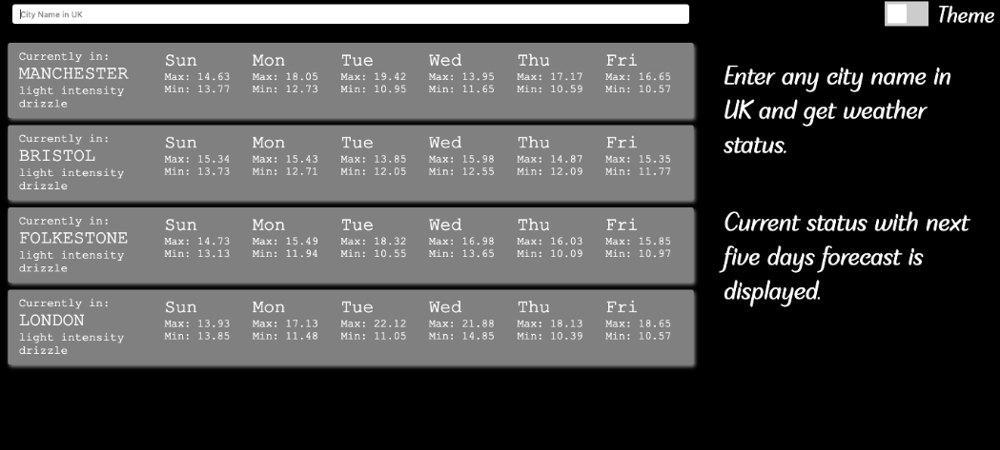
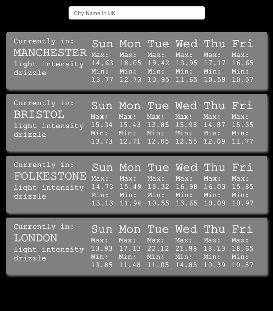

# How to run locally 
React express based application for generating weather reports.

This application is based on create react app. Express server has been added to massage the data and hide API keys. This should help to keep Front End application clean. 

Latest react hooks has been used instead tradition classes.

Dev mode commands to get you started 
```sh
$ git clone
$ cd react-express-weather-report
$ npm install
$ cd client 
$ npm install
$ cd ..
$ npm run dev

```
Note this will run two applications together, webpack dev server and node.js server. 


# Functionality

This app gets weather information for next five days of given city in UK.
User can also change theme (dark/light) which is stored in localstorage.

# Unit tests
Application uses jest and enzyme in order to unit test code. Some basic tests have been added. 

```sh
$ cd client 
$ npm test

```
# Live demo
https://express-react-weather.herokuapp.com/




