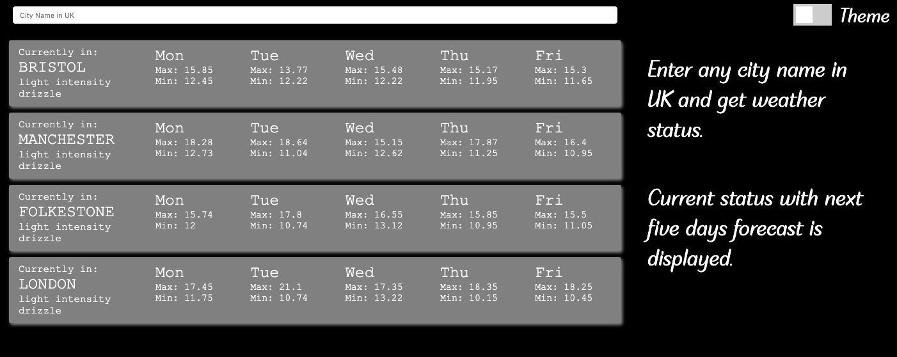
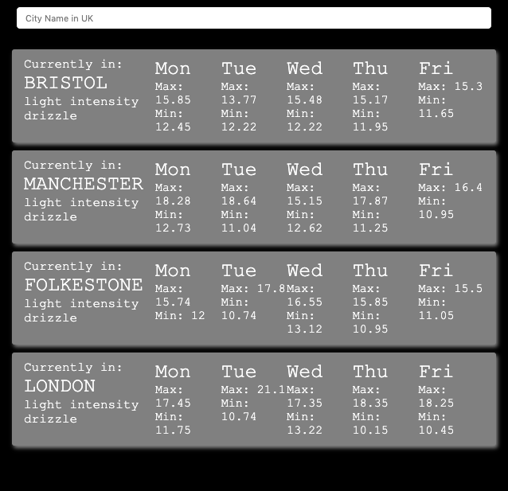
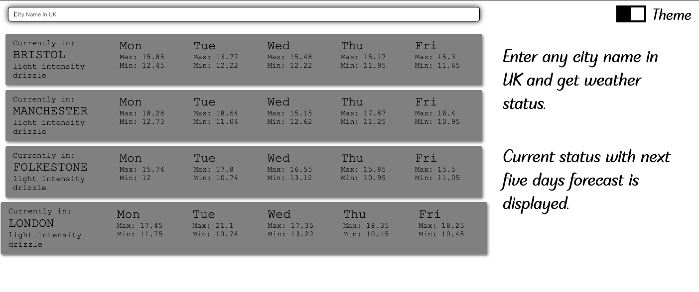
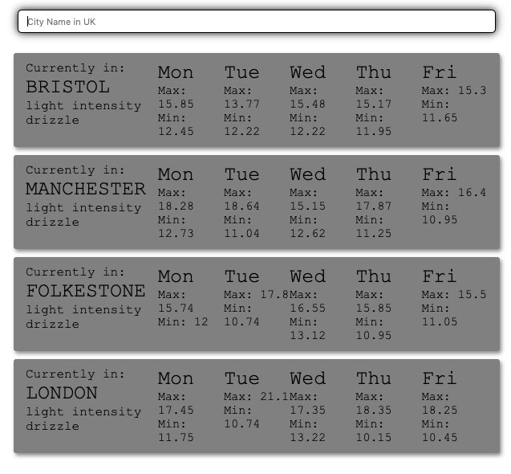

# How to run locally 
React(client) express(server/node) based application for generating weather reports (open weather API).

Application is based on create react app. Express server has been added to massage the data and hide API keys. This should help to keep Front End application clean and separate areas of concerns. Hence making it modular which should help with maintainability and scalability.

React hooks has been used instead tradition classes.

Dev mode commands to get you started 
```sh
$ git clone
$ cd react-express-weather-report
$ npm install
$ cd client 
$ npm install
$ cd ..
$ npm run dev

```
Note this will run two applications together, webpack dev server and node.js server. 


# Functionality

App gets weather information for next five days of given city in UK.
User can also change theme (dark/light) which is stored in localstorage.

London is displayed by default. User can enter name of any city in UK and press enter to get weather details.

Validation: 
    Duplicate location
    Invalid location

# Unit tests
Application uses jest and enzyme in order to unit test client code. 

```sh
$ cd client 
$ npm test
```

Coverage report
```sh
$ cd client 
$ npm run coverage
```

# Live demo
https://express-react-weather.herokuapp.com/





    


Todo: 
    Test hook component